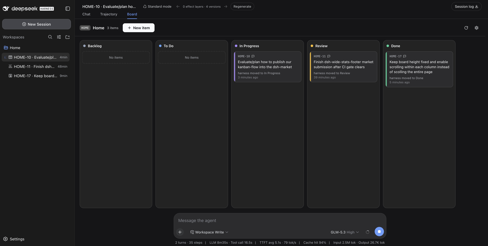

# dsh-kanban-flow

**Agent-driven kanban boards for [DeepSeek Harness](https://github.com/deepseek-ai/deepseek-harness) — one board per workspace, one task session per item.**



[](https://github.com/thomasvvugt/dsh-kanban-flow/actions/workflows/ci.yml)
[](LICENSE)

**You triage. The agent picks up, works, narrates every step in its own task session, and asks for review when it needs you.** The board enforces the workflow — not vibes: agents can't grab unassigned work, can't skip your review, and can't close items behind your back.

Partially based on the [dsh-kanban](https://github.com/alpacachen/dsh-kanban) plugin architecture, rebuilt around a multica-style human/agent workflow.

## Quick start

```sh
# from npm — prebuilt, no build-approval step
dsh plugin --profile web add dsh-kanban-flow

# or straight from GitHub
dsh plugin --profile web add github:thomasvvugt/dsh-kanban-flow
```

Restart `dsh web` afterwards. Confirm with `dsh --profile web --dump-config` (look for the `dsh-kanban-flow` layer). A kanban icon appears next to every workspace in the sidebar — click it to open that workspace's board.

## The workflow

Columns are fixed: **Backlog → To Do → In Progress → Review → Done**

| Who | Move | Meaning |
| --- | --- | --- |
| Human | Backlog → To Do | Hand the item to the agent (the only pickup trigger) |
| Agent | To Do → In Progress | Confirm pickup, start work |
| Agent | In Progress → Review | Needs a human (state the question in the task session / conversation) |
| Agent | Review → In Progress | Resume straight after human feedback |
| Agent | Done → In Progress | Reopen when the human replies on a finished item |
| Agent | In Progress → Done | Self-evaluated completion — only when confirmation is OFF |
| Human | Review → Done / In Progress | Accept / rework |

The host plugin enforces all of this in the `kanbanflow_move_item` tool — agents never move items into To Do, never complete from Review, and illegal moves are rejected with an explanation.

Replying in the item's task session while it is in Review sends the agent back to work: it acknowledges, moves the item Review → In Progress and addresses the feedback in the same turn.

## Highlights

**Boards live where your work lives**
- One board per workspace, opened in-app on the conversation's **Board** tab — no popups
- A kanban icon next to every workspace in the sidebar; workspace clicks open boards (toggleable back to session expansion in **Settings → Plugins → Kanban Flow**)
- Board views poll every 3s, so agent moves appear on the board while you watch

**One agent session per item**
- Pickup creates a task session named `CODE-12 · Item name` — click a card to jump straight into it
- Progress narration lives in that session; each card shows a compact latest-activity line ("harness moved to Done · 3 seconds ago")
- **Hover a card for the agent's latest status**: agents set a short status note (`kanbanflow_set_status`) at the end of every turn — what's done, what's next or what they need from you. It appears in a tooltip on hover (and in the item dialog); cards without a status yet show no tooltip
- Session-less workspaces aren't left out: their board pins into the current conversation's Board tab (header shows the board's code and workspace) and goes native once that workspace gets its own conversation

**Yours to tune**
- **Board code** per workspace (2–6 chars): item ids like `API-3`, `DKF-17`; existing ids stay stable when you change it
- **Require confirmation to complete work** (per board, gear menu): when on, the agent can never reach Done — you complete by dragging Review → Done
- Items carry id, name and description; deleting an item archives its task session

**Looks at home in DSH**
- Light & dark via DSH design tokens, with `light-dark()` column accents: slate/blue/violet/amber/emerald
- Responsive board: the five columns scale to fill the available width on desktop and stack vertically on tablet/phone (container queries, so it reacts to the board's real width — sidebars and all)
- Animated create/move transitions, drag lift with column highlight, agent-changed cards pulse — all respecting `prefers-reduced-motion`
- English end-to-end

## Agent tools

`kanbanflow_get` · `kanbanflow_get_item` · `kanbanflow_create_item` · `kanbanflow_update_item` ·
`kanbanflow_move_item` · `kanbanflow_delete_item` · `kanbanflow_set_status` · `kanbanflow_set_code`

## Storage & trust

- One JSON file per workspace: `<workspace>/.dsh-kanban-flow.json` — schema-versioned, migrated automatically, corrupt files backed up before being reset. Your board data never leaves the workspace.
- Ships prebuilt: no install-time scripts, no build step on install, and the only network call the client makes is to the plugin's own same-origin `/api/kanban-flow` route.

## Development

```sh
npm install
npm test          # vitest unit tests (state machine, ids, links, migrations)
npm run typecheck
npm run build     # rebuild lib/client.js (committed) via esbuild
```

CI runs tests, typecheck and build on every push; tagging a version (`v*`) publishes it to npm.

## Notes

- Built against DSH 0.1.1-rc.2. The sidebar icon and workspace-click behavior anchor on its sidebar markup (no per-row slot exists yet); they degrade to native behavior if the markup changes, and icons only appear in the expanded sidebar.

## Credits & license

- Architecture partially based on [dsh-kanban](https://github.com/alpacachen/dsh-kanban) by its author — thank you.
- MIT — see [LICENSE](LICENSE).
